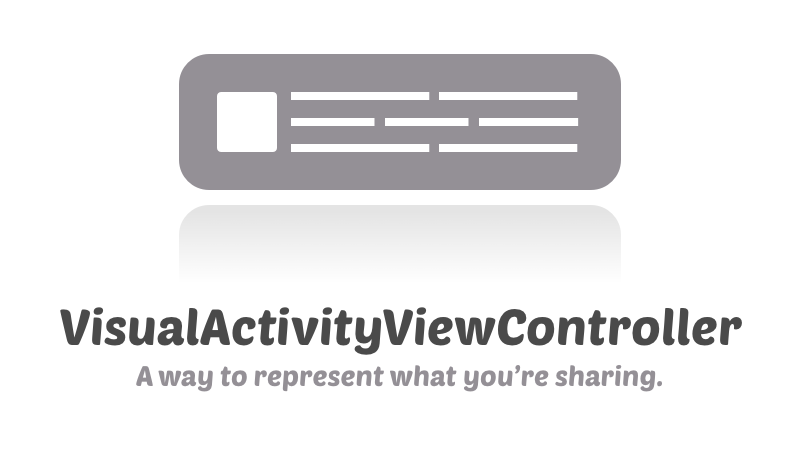
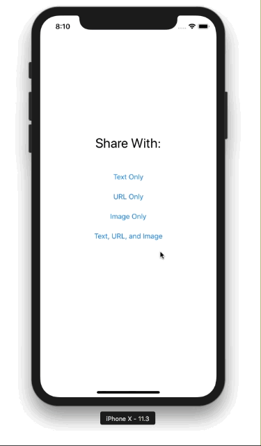

<p align="center">
  
</p>

<p align="center">
<a href="https://developer.apple.com/swift/"></a>
<br>
<a href="http://twitter.com/naturaln0va"></a>
</p>

<p align="center">
  
</p>

## About

This project provides a preview of items being shared via `UIActivityViewController`. Example:

```swift
// standard activity view controller
let vc = UIActivityViewController(activityItems: [shareText], applicationActivities: nil)

// custom activity view controller with a preview 
let vc = VisualActivityViewController(text: shareText)
```

## Features
* Text, Image, and URL previewing
* Swipe gesture to dismiss the share sheet
* Easy customization (match your app’s style)

## Requirements

* iOS 9.0+
* Xcode 9.0+

## Installation

To install, simply add the `VisualActivityViewController.swift` file to your project.

## Advanced Usage

There are quite a few different options to customize the appearance of the preview. Check out the example project to see how some of these options work.

```swift
/// The duration for the preview fading in
var fadeInDuration: TimeInterval = 0.3

/// The duration for the preview fading out
var fadeOutDuration: TimeInterval = 0.3

/// The corner radius of the preview
var previewCornerRadius: CGFloat = 12

/// The corner radius of the preview image
var previewImageCornerRadius: CGFloat = 3

/// The side length of the preview image
var previewImageSideLength: CGFloat = 80

/// The padding around the preview
var previewPadding: CGFloat = 12

/// The number of lines to preview
var previewNumberOfLines: Int = 5

/// The preview color for URL activity items
var previewLinkColor: UIColor = UIColor(red: 0, green: 0.47, blue: 1, alpha: 1)

/// The font for the preview label
var previewFont: UIFont = UIFont.systemFont(ofSize: 18)

/// The margin from the top of the viewController's window
var previewTopMargin: CGFloat = 8

/// The margin from the top of the viewController's view
var previewBottomMargin: CGFloat = 8
```

## License

This project is available under the MIT license. See the LICENSE file for more info.
